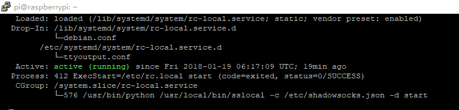

# Raspberry + Shadowsocks + Privoxy

## TF

## Config

```sh
## - change keyboard layout
## - enable ssh
$ sudo raspi-config
## check ip 
$ ifconfig
## ssh to raspberry pi
## default user is pi , and the password is raspberry 
$ ssh pi@[x.x.x.x]
```

## apt-get

```sh
## back up
$ sudo cp sources.list sources.list.bak
$ sudo cp sources.list.d/raspi.list sources.list.d/raspi.list.bak

## sudo vi source.list
#科大源
deb http://mirrors.ustc.edu.cn/raspbian/raspbian/ stretch main contrib non-free rpi

## sudo vi sources.list.d/raspi.list
#科大源
deb http://mirrors.ustc.edu.cn/archive.raspberrypi.org/debian/ stretch main ui stagging
```

## Shadowsocks

```sh
## apt-get
$ sudo apt-get install python-pip python-m2crypto
$ sudo pip install shadowsocks
## config
$ sudo vi /etc/shadowsocks.json

{
    "server":"xxx.xxx.xxx.xxx",
    "server_port":xxx,
    "local_address": "127.0.0.1",
    "local_port":1080,
    "password":"xxx",
    "timeout":600,
    "method":"aes-256-cfb",
    "fast_open": false
}
## add to system startup
$ sudo vi /etc/rc.local

## add before exit 0
/usr/local/bin/sslocal -c /etc/shadowsocks.json -d start

## check 
$ sudo systemctl status rc-local.service

```



>If fail to start privoxy
>
> https://github.com/shadowsocks/shadowsocks/issues/946
>
>`/usr/local/lib/python2.7/dist-packages/shadowsocks/crypto/openssl.py` 请你将此文件中的**52**行和**111**行中的`cleanup`更新为`reset`后，再尝试启动。这是由于openssl库更新导致名称变更的问题（参见：[openssl官网介绍](https://www.openssl.org/docs/man1.1.0/crypto/EVP_EncryptInit.html#HISTORY)）。如有疑问，欢迎提出。

## Privoxy

```sh
## apt-get
$ sudo apt-get install python-pip privoxy

## config
$ sudo vi /etc/privoxy/config

listen-address  0.0.0.0:port
forward-socks5 / 127.0.0.1:1080 .
actionsfile pac.action      # pac customization

## pac action 
sudo cp user.action pac.action

{{alias}}
direct      = +forward-override{forward .}
ssh         = +forward-override{forward-socks5 127.0.0.1:1080 .}
default     = ssh
#==========default=============
{default}
/
#====================
{direct}
.qq.com
.youku.com
.bilibili.com
.baidu.com


## start
sudo /etc/init.d/privoxy start

## check 
netstat -an | grep [port]
```

## Firewall

```sh
$ sudo apt-get install ufw
## enable
$ sudo ufw enable
$ sudo ufw default deny ##default set to deny
## disable
$ sudo ufw disable
## show status
$ sudo ufw status
## enable connection from lan
sudo ufw allow from 10.0.0.0/8
sudo ufw allow from 172.16.0.0/12
sudo ufw allow from 192.168.0.0/16

## my final choice
sudo ufw enable
sudo ufw allow from 192.168.0.0/16
sudo ufw default deny
```

## Password

```sh
## modify pi password
$ sudo passwd pi
## set root password
$ sudo passwd root
```

## Static IP

```sh
## modify /etc/dhcpcd.conf
$ sudo vi /etc/dhcpcd.conf

## append
interface wlan0 ## check your interface
static ip_address=192.168.0.150/24
static routers=192.168.2.1
static domain_name_servers=192.168.2.1 8.8.8.8
```

## Backup

```sh
## find micro sd
$ diskutil list

$ dd if=/dev/disk2 of=/path/to/raspberryBackupImage.img bs=1m
```


## Bonus - setting WiFi via terminal

```sh
## scanning wifi
$ iwlist scannig

## add wifi to /etc/wpa_supplicant/wpa_supplicant.conf
$ vi /etc/wpa_supplicant/wpa_supplicant.conf

## example
network={
    ssid="your wifi name（ssid）" ## listed by scannig
    key_mgmt=WPA-PSK ## WiFi use WPA/WPA2
    psk="your wifi passwd"
}
```
